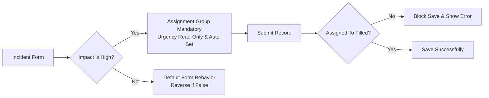

<h1 align="center">Implement Client Script & UI Policy (Incident)</h1>

<p align="center">
  <strong>ServiceNow Incident Management Form Control & Validation Workflow</strong>
</p>

<p align="center">
  Enforcing conditional field behavior, automated updates, and save-time validation on Incident records using UI Policies and Client Scripts.
</p>

<p align="center">
  <code>ServiceNow</code>
  <code>UI Policy</code>
  <code>Client Scripts</code>
  <code>Form Validation</code>
  <code>Incident Management</code>
</p>

## Overview

**Implement Client Script & UI Policy (Incident)** is a ServiceNow-based project designed to ensure consistent and accurate data entry on Incident records. 

Relying solely on user awareness and manual checks can lead to incomplete, inconsistent, or incorrect data submissions, which impacts reporting accuracy and SLA compliance. This project implements standardized **UI Policies**, **UI Policy Actions**, and **Client Scripts** (onChange, onSubmit, onCellEdit) to control field visibility, mandatory status, and save-time validations directly at the user interface level.

---

## System Flow



---

## Objectives

<div align="center">

|     | Objective            | Purpose                                  |
| :-: | -------------------- | ---------------------------------------- |
|  01 | Data Integrity       | Enforce mandatory fields for high-impact |
|  02 | Automated Updates    | Auto-populate urgency based on impact    |
|  03 | Save-Time Validation | Prevent record submission if unassigned  |
|  04 | List Edit Restriction| Block direct state changes in list view  |
|  05 | Condition Reversion  | Revert field rules when conditions clear |

</div>

---

## Architecture & Configuration

```text
                          INCIDENT FORM
                               │
            ┌──────────────────┴──────────────────┐
            â–¼                                     â–¼
     ┌─────────────┐                       ┌──────────────┐
     │  UI Policy  │                       │ Client Script│
     └──────┬──────┘                       └──────┬───────┘
            │                                     │
      ┌─────┴─────┐                         ┌─────┼─────┐
      â–¼           â–¼                         â–¼     â–¼     â–¼
 Assignment  Urgency                      onChange onSubmit onCellEdit
  Mandatory Read-Only                      Auto-Urgency Save-Block List-Block
```

---

## Key Features & Implementations

### 1. UI Policy: High Impact Control
* **Table:** `Incident`
* **Condition:** `Impact` is `1 - High`
* **Actions:** 
  * Sets `Assignment group` to **Mandatory**.
  * Sets `Urgency` to **Read-only**.
  * Enables **Reverse if false** so that field rules automatically revert when the condition is not met.

### 2. onChange Client Script
* **Name:** `Auto set urgency for high impact`
* **Trigger:** When the `Impact` field changes.
* **Action:** Automatically updates the `Urgency` field to `1 - High` and displays an info message when high impact is selected.

### 3. onSubmit Client Script (Save Validation)
* **Name:** `Prevent save if assigned to missing`
* **Trigger:** Record submission (`onSubmit`).
* **Action:** Checks if `Impact` is High and `Assigned To` is empty; if so, blocks saving and displays an error box.

### 4. onCellEdit Client Script
* **Name:** `Prevent state change via list edit`
* **Trigger:** Direct list editing on the `State` field.
* **Action:** Blocks unauthorized inline edits from the list view and prompts the user to open the form instead.

---

## Technology Stack

<p align="center">

| Platform | Configuration Tools | Scripting Types | Validation Scope |
| :--- | :--- | :--- | :--- |
| ServiceNow | UI Policies & Actions | onChange | Form-level rules |
| Personal Developer Instance | Client Scripts | onSubmit | Save-time checks |
| Incident Table | Form Customization | onCellEdit | List-level security |

</p>

---

## End-to-End Testing Workflow

```text
01  Navigate to Incident -> Create New
        ↓
02  Set Impact field to High-1
        ↓
03  Verify Urgency auto-sets and Assignment Group becomes mandatory
        ↓
04  Leave Assigned To empty and attempt to Submit
        ↓
05  Verify save is blocked with an error message
        ↓
06  Populate Assigned To and submit successfully
        ↓
07  Test changing Impact back to Medium (verify reverse conditions)
        ↓
08  Test list editing on State column (verify cell edit block)
```

---

## Conclusion

This micro project effectively demonstrates how **UI Policies and Client Scripts** work together to enforce dynamic field behavior, automate updates, and prevent incorrect data submission on ServiceNow Incident forms. 

The solution maintains clean, consistent data while remaining lightweight, efficient, and aligned with platform best practices.
